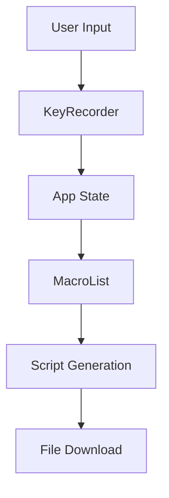

# AHK Macro Generator - Project Report

## Table of Contents
1. [Introduction](#introduction)
2. [Chapter 1: Project Overview and Requirements Analysis](#chapter-1)
3. [Chapter 2: Technical Implementation and Architecture](#chapter-2)
4. [Conclusion](#conclusion)

## Introduction
### Background
The AHK Macro Generator is a modern web application designed to simplify the creation and management of AutoHotkey scripts. AutoHotkey is a powerful automation scripting language for Windows, but creating scripts manually can be challenging for users without programming experience. This project aims to bridge that gap by providing an intuitive graphical interface for creating AutoHotkey macros.

### Project Objectives
1. Create a user-friendly interface for generating AutoHotkey scripts
2. Support multiple types of automation actions
3. Provide multilingual support (English and French)
4. Enable easy management of multiple macros
5. Allow both single and batch script downloads

### Scope
The project encompasses:
- Web-based user interface
- Key combination recording system
- Multiple action type support
- Script generation engine
- Internationalization system
- File management capabilities

## Chapter 1: Project Overview and Requirements Analysis

### 1.1 Functional Requirements

#### 1.1.1 Key Recording System
- Record keyboard combinations in real-time
- Support modifier keys (Ctrl, Alt, Shift, Win)
- Visual feedback during recording
- Ability to clear and re-record combinations

#### 1.1.2 Action Types
1. Application Control
   - Open applications
   - Open websites
   - Activate specific windows

2. System Operations
   - Volume control
   - Brightness control
   - Command execution

3. Text Operations
   - Text replacement
   - Send keystrokes
   - Quick notes

4. Productivity Features
   - Email composition
   - Timer functionality
   - Clipboard history

#### 1.1.3 Script Management
- Save macros with custom names
- Download individual scripts
- Download all scripts as one file
- Download scripts as separate files
- Delete existing macros

#### 1.1.4 Internationalization
- Support for English language
- Support for French language
- Dynamic language switching
- Persistent language selection

### 1.2 Non-Functional Requirements

#### 1.2.1 Usability
- Intuitive user interface
- Clear visual feedback
- Consistent design language
- Responsive layout
- Tooltips and help text

#### 1.2.2 Performance
- Real-time key recording
- Immediate UI updates
- Fast script generation
- Efficient file handling

#### 1.2.3 Maintainability
- Modular component structure
- Clear separation of concerns
- Consistent coding standards
- Comprehensive documentation

#### 1.2.4 Compatibility
- Modern web browsers support
- Windows operating system compatibility
- AutoHotkey v1 script generation

### 1.3 User Interface Design

#### 1.3.1 Main Components
1. Header
   - Application title
   - Language selector
   - Navigation elements

2. Key Recorder Section
   - Action type selector
   - Recording interface
   - Visual feedback area

3. Macro List
   - Saved macros display
   - Action buttons
   - Download options

#### 1.3.2 Design Principles
- Material Design guidelines
- Consistent color scheme
- Clear typography hierarchy
- Responsive grid system
- Accessible contrast ratios

## Chapter 2: Technical Implementation and Architecture

### 2.1 Technology Stack

#### 2.1.1 Frontend Technologies
- React.js for UI components
- Material-UI for design system
- Context API for state management
- JavaScript ES6+ features

#### 2.1.2 Development Tools
- Node.js development environment
- npm package manager
- Git version control
- VS Code IDE

### 2.2 System Architecture

#### 2.2.1 Component Structure
1. App Component (Root)
   - Global state management
   - Routing logic
   - Main layout

2. KeyRecorder Component
   - Key recording logic
   - Action selection
   - Form validation

3. MacroList Component
   - Macro display
   - File generation
   - Download handling

4. LanguageContext
   - Language state
   - Translation functions
   - Language switching

#### 2.2.2 Data Flow


### 2.3 Implementation Details

#### 2.3.1 Key Recording System
```javascript
useEffect(() => {
  const handleKeyDown = (e) => {
    if (!isRecording) return;
    e.preventDefault();
    const key = e.key.toUpperCase();
    const modifiers = [];
    if (e.ctrlKey && key !== 'CONTROL') modifiers.push('Ctrl');
    if (e.altKey && key !== 'ALT') modifiers.push('Alt');
    if (e.shiftKey && key !== 'SHIFT') modifiers.push('Shift');
    if (e.metaKey && key !== 'META') modifiers.push('Win');
    setRecordedKeys([...modifiers, key]);
  };

  if (isRecording) {
    window.addEventListener('keydown', handleKeyDown);
  }

  return () => {
    window.removeEventListener('keydown', handleKeyDown);
  };
}, [isRecording]);
```

#### 2.3.2 Script Generation
```javascript
const generateAHKScript = (hotkeys) => {
  const header = `; AutoHotkey Script
#NoEnv
#SingleInstance Force
SetWorkingDir %A_ScriptDir%`;

  const hotkeyScripts = hotkeys.map(hotkey => {
    const keys = hotkey.keys.join(' + ');
    const action = generateAction(hotkey.action);
    return `
${keys}::
${action}
return`;
  });

  return header + hotkeyScripts.join('\n');
};
```

#### 2.3.3 Internationalization System
```javascript
const LanguageContext = createContext();

export const LanguageProvider = ({ children }) => {
  const [currentLanguage, setCurrentLanguage] = useState('en');

  const t = (key) => {
    const keys = key.split('.');
    let value = translations[currentLanguage];
    for (const k of keys) {
      value = value[k];
    }
    return value || key;
  };

  return (
    <LanguageContext.Provider value={{ currentLanguage, setCurrentLanguage, t }}>
      {children}
    </LanguageContext.Provider>
  );
};
```

### 2.4 Testing and Quality Assurance

#### 2.4.1 Testing Methodology
- Unit testing of components
- Integration testing of features
- User acceptance testing
- Cross-browser testing

#### 2.4.2 Quality Metrics
- Code coverage
- Performance benchmarks
- User feedback
- Error tracking

## Conclusion

### Project Achievements
1. Successfully implemented a user-friendly interface for AHK script generation
2. Developed a robust key recording system
3. Implemented comprehensive action type support
4. Created an efficient script generation engine
5. Added multilingual support
6. Enabled flexible file management options

### Future Enhancements
1. Additional language support
2. More action types
3. Cloud storage integration
4. Script editing capabilities
5. Advanced macro scheduling
6. Community sharing features

### Lessons Learned
1. Importance of user feedback in design
2. Benefits of modular architecture
3. Value of comprehensive testing
4. Significance of documentation
5. Impact of good error handling

### Final Thoughts
The AHK Macro Generator project successfully meets its objectives of simplifying AutoHotkey script creation while maintaining flexibility and power. The implementation of modern web technologies and thoughtful design choices has resulted in a tool that serves both novice and experienced users effectively.

## Installation and Usage

### Prerequisites
- Node.js 14.0 or later
- AutoHotkey v2 (for running generated scripts)

### Setup Instructions
```bash
# Clone the repository
git clone [repository-url]

# Install dependencies
npm install

# Start development server
npm start

# Build for production
npm run build
```

### Usage Guide
1. Start the application
2. Click "Start Recording" to capture a new hotkey
3. Configure the action for the recorded hotkey
4. Manage your macros in the list
5. Download and use your generated scripts

---
*Project developed by [Your Name]*
*[Your Institution]*
*[Date]* 