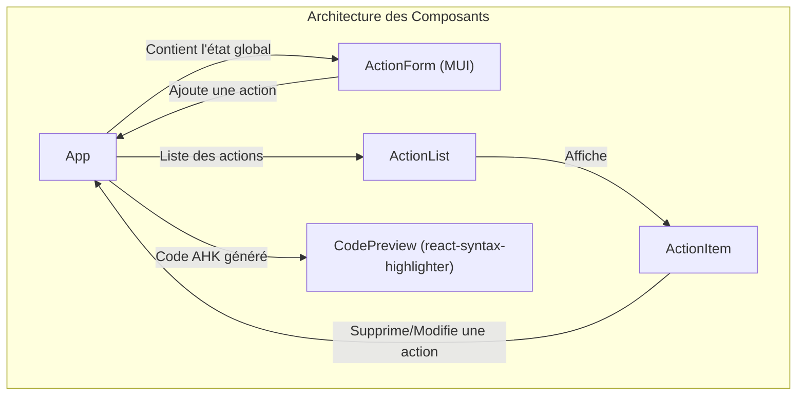
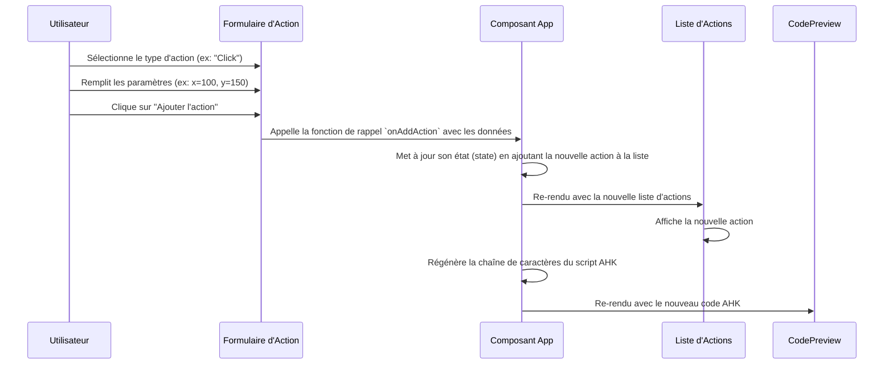

# Rapport Technique : AHK Macro Generator

## Résumé

Ce rapport présente la conception et le développement de "AHK Macro Generator", une application web développée en React. L'objectif principal de cette application est de fournir une interface utilisateur graphique (GUI) intuitive pour la création de scripts AutoHotkey (AHK). Elle permet aux utilisateurs, même sans connaissance préalable du langage de script AHK, de générer des macros d'automatisation des tâches en assemblant des actions prédéfinies. L'application génère le code AHK correspondant en temps réel et permet de le télécharger sous forme de fichier `.ahk`, prêt à l'emploi.

## Abstract

This report details the design and development of "AHK Macro Generator," a web application built with React. The primary objective of this application is to provide an intuitive Graphical User Interface (GUI) for creating AutoHotkey (AHK) scripts. It enables users, even those without prior knowledge of the AHK scripting language, to generate task automation macros by assembling predefined actions. The application generates the corresponding AHK code in real-time and allows it to be downloaded as a ready-to-use `.ahk` file.

---

## Introduction Générale

AutoHotkey (AHK) est un langage de script open-source puissant pour Microsoft Windows, initialement conçu pour créer des raccourcis clavier ou des raccourcis, mais qui a évolué vers un langage de script complet pour l'automatisation de tâches de toute sorte. Bien que puissant, l'apprentissage de la syntaxe et des commandes AHK peut représenter un obstacle pour les nouveaux utilisateurs ou ceux qui ne sont pas des développeurs.

Le projet "AHK Macro Generator" a été conçu pour résoudre ce problème. Il vise à démocratiser l'automatisation des tâches sur Windows en offrant une plateforme web simple et accessible. L'application abstrait la complexité de la syntaxe AHK derrière une interface graphique conviviale, permettant aux utilisateurs de se concentrer sur la logique de leurs macros plutôt que sur les détails du code. En utilisant des technologies web modernes comme React et Material-UI, l'application offre une expérience utilisateur fluide et réactive.

Ce document décrira le processus de développement de l'application, en commençant par l'analyse des besoins qui ont motivé sa création, en passant par la conception technique détaillée et en terminant par une présentation de son application pratique.

---

## Chapitre 1 : Analyse et Spécification des Besoins

### 1.1 Analyse des Besoins

L'analyse initiale a identifié un besoin clair chez un large éventail d'utilisateurs de Windows : le désir d'automatiser des tâches répétitives (par exemple, des séquences de clics de souris et de frappes au clavier) sans avoir à investir un temps considérable dans l'apprentissage d'un langage de programmation.

Les besoins identifiés sont les suivants :
- **Simplicité** : Les utilisateurs ont besoin d'une interface qui ne nécessite aucune compétence en programmation.
- **Visualisation** : Il est important de pouvoir voir le script généré pour comprendre (et potentiellement apprendre) la syntaxe AHK.
- **Portabilité** : La solution doit être accessible facilement, sans installation complexe. Une application web est idéale pour cela.
- **Autonomie** : Les utilisateurs doivent pouvoir créer et sauvegarder leurs scripts pour une utilisation ultérieure.

### 1.2 Spécification des Besoins

Sur la base de l'analyse, nous avons défini les spécifications fonctionnelles et non fonctionnelles de l'application.

#### 1.2.1 Besoins Fonctionnels

- **BF1 : Création de script** : L'utilisateur doit pouvoir démarrer la création d'un nouveau script de macro.
- **BF2 : Ajout d'actions** : L'utilisateur doit pouvoir ajouter différentes types d'actions à son script à partir d'une liste, notamment :
    - Envoyer une séquence de touches (`Send`).
    - Effectuer un clic de souris à des coordonnées spécifiques (`Click`).
    - Déplacer le curseur de la souris (`MouseMove`).
    - Ajouter une pause ou un délai (`Sleep`).
- **BF3 : Paramétrage des actions** : Chaque action ajoutée doit pouvoir être paramétrée (par exemple, spécifier les touches à envoyer, les coordonnées x/y du clic, la durée du délai).
- **BF4 : Définition d'un raccourci de déclenchement** : L'utilisateur doit pouvoir associer un raccourci clavier (hotkey) au script généré (par exemple, `^!N` pour `Ctrl+Alt+N`).
- **BF5 : Prévisualisation du code** : L'application doit afficher en temps réel le code AHK correspondant à la séquence d'actions créée.
- **BF6 : Téléchargement du script** : L'utilisateur doit pouvoir télécharger le script généré sous forme d'un fichier avec l'extension `.ahk`.

#### 1.2.2 Besoins Non-Fonctionnels

- **BNF1 : Interface Utilisateur Intuitive** : L'interface doit être claire, moderne et facile à utiliser, en s'appuyant sur des composants de la librairie Material-UI.
- **BNF2 : Performance** : L'application doit être rapide et réactive, même avec des scripts contenant de nombreuses actions.
- **BNF3 : Compatibilité Navigateurs** : L'application doit être compatible avec les dernières versions des navigateurs web modernes (Chrome, Firefox, Safari).
- **BNF4 : Accessibilité** : L'application doit être hébergée en ligne et accessible via une URL publique (GitHub Pages).

---

## Chapitre 2 : Conception Détaillée

### 2.1 Architecture de l'Application

L'application est une **Single Page Application (SPA)** développée avec la librairie **React**. Cette architecture a été choisie pour sa capacité à créer des interfaces utilisateur dynamiques et réactives sans nécessiter de rechargement de page.

Le projet est initialisé avec `create-react-app`, ce qui fournit une structure de projet standard et un ensemble d'outils de développement préconfigurés (Babel, Webpack).

L'état global de l'application (la liste des actions, le raccourci clavier) est géré au niveau du composant principal `App` et transmis aux composants enfants via les *props*.

### 2.2 Conception des Composants

L'interface est décomposée en plusieurs composants React réutilisables, suivant une approche modulaire.



- **`App.js`** : Le composant racine qui orchestre l'ensemble de l'application. Il maintient l'état de la liste des actions et du raccourci clavier, et contient la logique de génération du script AHK.
- **`ActionForm.js`** : Un formulaire (utilisant des composants Material-UI comme `TextField`, `Select`, `Button`) qui permet à l'utilisateur de choisir un type d'action et de saisir ses paramètres.
- **`ActionList.js`** : Un composant qui affiche la liste des actions créées par l'utilisateur. Il mappe sur la liste des actions et rend un composant `ActionItem` pour chacune.
- **`ActionItem.js`** : Représente une seule action dans la liste, affichant ses détails et offrant des boutons pour la modifier ou la supprimer.
- **`CodePreview.js`** : Affiche le code AHK généré. Il utilise la librairie `react-syntax-highlighter` pour une coloration syntaxique appropriée, améliorant la lisibilité.

### 2.3 Diagramme de Séquence : Ajout d'une Action

Le diagramme ci-dessous illustre le flux d'interactions lorsqu'un utilisateur ajoute une nouvelle action à son script.


---

## Application Pratique

### 3.1 Guide d'Utilisation

L'utilisation de "AHK Macro Generator" est un processus simple en quatre étapes :

1.  **Définir le Raccourci Clavier** : L'utilisateur commence par définir la combinaison de touches qui déclenchera la macro. Par exemple, `^!P` pour `Ctrl+Alt+P`.

2.  **Ajouter des Actions** : En utilisant le formulaire d'actions, l'utilisateur ajoute séquentiellement les opérations qu'il souhaite automatiser. Pour chaque action, il choisit le type (Clic, Frapper, Délai, etc.) et remplit les champs nécessaires. Chaque action ajoutée apparaît dans la liste des actions.

3.  **Prévisualiser le Script** : À chaque modification de la liste d'actions, le panneau de prévisualisation du code est mis à jour instantanément. Cela permet à l'utilisateur de voir le résultat de ses choix, formaté comme un véritable script AHK.
    
    Exemple de code généré :
    ```autohotkey
    ^!P::
    ; Script généré par AHK Macro Generator
    Click, 100, 200
    Sleep, 500
    Send, Hello, World!
    return
    ```

4.  **Télécharger le Fichier .ahk** : Une fois satisfait du script, l'utilisateur clique sur le bouton "Télécharger". L'application génère un fichier (par exemple, `macro.ahk`) que le navigateur télécharge. Ce fichier peut être exécuté directement sur n'importe quel ordinateur où AutoHotkey est installé.

### 3.2 Technologies Utilisées

- **React** : Pour la construction de l'interface utilisateur réactive et basée sur les composants.
- **Material-UI (MUI)** : Pour une bibliothèque complète de composants UI (boutons, champs de texte, icônes) qui garantissent une conception cohérente et professionnelle.
- **React Syntax Highlighter** : Pour afficher le code AHK généré avec une coloration syntaxique, ce qui le rend facile à lire.
- **Gh-pages** : Pour le déploiement simple et rapide de l'application sur GitHub Pages, la rendant publiquement accessible. 